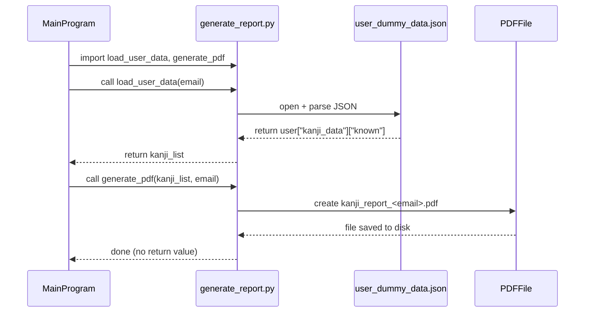

# Kanji Report Generator Microservice

This is a microservice for the Kanji Crow CLI flashcard program that generates a formatted PDF report of a user's known kanji list.

## Communication Contract

### How to REQUEST data

To request a report, call the `generate_pdf(email)` function from this microservice.

You’ll need to:
- Pass in the user’s email as a string
- Make sure that email exists in the user JSON file: `user_dummy_data.json`

**Example call:**

```python
from generate_report import generate_pdf, load_user_data

email = "test@gmail.com"
kanji_list = load_user_data(email)
generate_pdf(kanji_list, email)
```

This call will create a PDF file like this in the same folder:
```
kanji_report_test_at_gmail.com.pdf
```

## How to RECEIVE data

This microservice saves the output report as a `.pdf` file to the local directory. Your program can check for that file after the report is generated.

**Example:**

```python
filename = f"kanji_report_{email.replace('@', '_at_')}.pdf"
# You could open it, move it, or notify the user
print("PDF saved at:", filename)
```

So the newly created PDF is the response. There’s nothing returned by the `generate_pdf()` function.

## Setup

1. Clone this repo:
```bash
git clone https://github.com/Ablakes/kanji-pdf-generator.git
cd kanji-pdf-generator
```

2. Install one dependency:
```bash
pip install fpdf
```

3. Download the required font file:

This program uses a Japanese-compatible font to render kanji correctly in the PDF.

- Download [NotoSansJP-Regular.ttf](https://fonts.google.com/noto/specimen/Noto+Sans+JP)
- Save the file in the same folder as `generate_report.py`
- Make sure the filename is exactly: `NotoSansJP-Regular.ttf`

If the font isn’t installed, the PDF generation will fail with an error.

4. Make sure the `user_dummy_data.json` file is available and points to real data.

---

## 📊 UML Sequence Diagram

This diagram shows how the main program requests and receives a kanji PDF report from the microservice.

